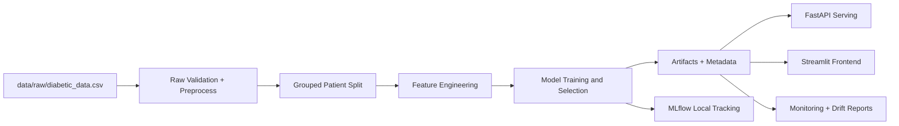

# Diabetes Hospital Readmission Pipeline


## Executive Summary

This repository is an end-to-end, local-first machine learning system for diabetes hospital readmission prediction. It covers the full lifecycle: raw-data validation, leakage-aware splitting, feature engineering, model training and evaluation, experiment tracking with MLflow, API serving with FastAPI, artifact-direct frontend delivery with Streamlit, and drift-oriented monitoring.

The project is structured as a realistic portfolio demonstration of applied ML engineering rather than a notebook-only model experiment. It emphasizes reproducibility, operational clarity, deployment pragmatism, and transparent artifacts that reviewers can inspect directly.

## Why This Project Matters

30-day readmission is operationally and financially important in hospital systems. Predicting near-term readmission risk can inform discharge planning, triage, and follow-up workflows, while multiclass horizon prediction adds broader context (`NO`, `>30`, `<30`).

This repository is a technical demonstration of ML systems design in a healthcare-inspired setting. It is not a clinical decision-support system, and it is not validated for patient care.

**Non-medical-use disclaimer:** all predictions and explanations in this repository are for engineering demonstration only and must not be used for diagnosis, treatment, or clinical decision-making.

## Key Capabilities

The pipeline is designed as a coherent system where each stage exists to solve a specific production-style problem:

- **Raw validation and data dictionary generation:** catches schema/value issues early and produces reviewer-facing quality artifacts (`reports/raw_validation_report.md`, `reports/data_dictionary.md`).
- **Leakage-aware preprocessing and grouped splitting:** creates `readmitted_30d`, normalizes null-like tokens, and performs patient-level grouped splits to reduce repeated-encounter leakage.
- **Clinically informed feature engineering:** adds engineered risk/utilization features (`recurrency`, `patient_severity`, `medication_change_ratio`, `utilization_intensity`, `complex_discharge_flag`, `age_bucket_risk`) and persists feature metadata.
- **Binary and multiclass modeling:** evaluates multiple model families and sampling strategies, then promotes best artifacts with metadata and evaluation outputs.
- **Experiment tracking:** logs local runs via MLflow (SQLite backend + local artifacts store).
- **API serving:** exposes prediction, batch prediction, and explanation endpoints through FastAPI with strict request/response schemas.
- **Streamlit frontend:** provides a portfolio-facing interface that loads committed model artifacts directly, including deterministic explanation mode for public deployment safety.
- **Monitoring and drift reporting:** writes JSONL prediction logs and generates summary/report outputs with PSI-based drift checks.
- **Demo workflow:** produces reproducible API responses and a concise demo summary for reviewer walkthroughs.
- **Docker and CI:** includes containerized API launch and automated lint/test/smoke validation paths.

## Architecture Overview

### Repository Modules

- `src/config`: environment configuration, path normalization, and local URI handling.
- `src/data`: raw loading, validation, preprocessing, and grouped split utilities.
- `src/features`: feature engineering logic and feature metadata support.
- `src/models`: pipeline factory, training orchestration, prediction, and evaluation routines.
- `src/serving`: FastAPI app and pydantic schemas for serving contracts.
- `src/llm`: explanation layer with Ollama-first optional mode and deterministic fallback.
- `src/monitoring`: prediction log construction, drift calculations, and monitoring narrative/report generation.
- `src/frontend`: Streamlit pages and lightweight artifact-loading/prediction helpers.
- `scripts`: operator entry points for validation, training, evaluation, serving, monitoring, and demos.
- `tests`: unit/integration/smoke coverage for core data, modeling, API, frontend, and runtime guardrails.
- `docs`: local workflow guide, results summary, troubleshooting, and release checklist.

### System Flow



## Dataset

- **Expected local file:** `data/raw/diabetic_data.csv`
- **Dataset lineage:** Diabetes 130-US hospitals style dataset usage (as documented in project materials).
- **Primary target:** `readmitted`
- **Binary target:** `readmitted_30d` (positive label `<30`)
- **Multiclass labels:** `NO`, `>30`, `<30`

Caveat: this is a single-dataset, local workflow intended for engineering demonstration. Generalization and clinical validity are out of scope.

## Project Workflow

End-to-end execution order:

1. Raw validation and schema checks.
2. Preprocessing with null-token normalization and binary target derivation.
3. Leakage-safe grouped split by patient.
4. Feature engineering and metadata export.
5. Binary and multiclass model training.
6. Evaluation and model comparison report generation.
7. Local MLflow run tracking and inspection.
8. FastAPI serving for predict/predict-batch/explain.
9. Streamlit artifact-direct frontend execution.
10. Monitoring summary/report generation with drift checks.
11. Demo/showcase artifact generation for portfolio walkthroughs.

## Commands and Usage

### 1) Environment setup

```powershell
pip install uv
uv sync --group dev --extra eda
Copy-Item .env.example .env
uv run python scripts/healthcheck.py
```

### 2) Raw validation

```powershell
uv run python scripts/run_raw_validation.py
```

### 3) Processed data build

```powershell
uv run python scripts/build_processed_data.py
```

### 4) Feature build

```powershell
uv run python scripts/build_feature_sets.py
```

### 5) Binary training

```powershell
uv run python scripts/train_binary.py
```

### 6) Multiclass training

```powershell
uv run python scripts/train_multiclass.py
```

### 7) Evaluation

```powershell
uv run python scripts/run_evaluation.py
```

### 8) MLflow server

```powershell
uv run python scripts/run_mlflow_server.py
```

### 9) FastAPI app

```powershell
uv run python scripts/run_api.py
```

### 10) Monitoring report

```powershell
uv run python scripts/run_monitoring_report.py
```

### 11) Demo workflow

```powershell
uv run python scripts/demo_smoke_run.py
```

### 12) Streamlit frontend

```powershell
uv run streamlit run streamlit_app.py
```

## Results and Evaluation

Latest committed comparison results (from `reports/model_comparison_report.md`):

- **Binary best model:** XGBoost (`sampling=none`)
- **Binary primary metric (F1):** `0.3661`
- **Multiclass best model:** XGBoost
- **Multiclass primary metric (Macro F1):** `0.5250`

Additional committed multiclass test metrics (from `artifacts/multiclass_model_metadata.json`):

- Accuracy: `0.7324`
- Class-level behavior:
  - `NO`: strong F1/recall (`f1=0.8434`, `recall=0.9117`)
  - `>30`: moderate balance (`f1=0.6542`)
  - `<30`: low recall (`recall=0.0419`) despite higher precision (`0.5152`)

Interpretation and tradeoffs:

- The binary test confusion matrix indicates a high-recall/low-precision tradeoff on the positive class under class imbalance.
- The multiclass model performs well on dominant classes while under-retrieving the rare `<30` class, a common operational tradeoff in skewed hospital outcomes.
- XGBoost won because it delivered the strongest primary metrics across both tasks under the current feature set and split strategy.

## Artifact and Output Map

- `artifacts/`
  - trained models and metadata
  - sample payloads
  - evaluation images/SHAP summaries
  - monitoring logs (`artifacts/monitoring/prediction_log.jsonl`)
  - demo response files (`artifacts/demo/*`)
- `reports/`
  - validation, preprocessing, feature, model comparison, monitoring, and demo summaries
- `docs/`
  - workflow, troubleshooting, results summary, release checklist
- `data/processed/`
  - split and feature parquet outputs used by training/evaluation

## MLflow and Observability

MLflow is configured for local development:

- **Tracking server:** `http://127.0.0.1:5000`
- **Backend store:** `sqlite:///mlflow.db`
- **Artifact store:** `./mlartifacts` (resolved to local file URI)
- **Launch command:** `uv run python scripts/run_mlflow_server.py`

What reviewers should inspect:

- experiment runs and parameter/metric lineage
- binary vs multiclass run comparisons
- artifact links and model-selection rationale consistency with `reports/model_comparison_report.md`

## API

Start API:

```powershell
uv run python scripts/run_api.py
```

Swagger docs: `http://127.0.0.1:8000/docs`

Endpoints:

- `GET /health`: readiness and artifact/status context
- `POST /predict`: single-row binary + multiclass prediction
- `POST /predict-batch`: batch scoring
- `POST /explain`: prediction + explanation payload

Explanation behavior:

- Optional Ollama path when enabled/available
- Deterministic fallback path for robust local/public demo behavior

## Streamlit Frontend

Frontend entrypoint: `streamlit_app.py`

What it provides:

- artifact-direct binary and multiclass scoring
- deterministic explanation rendering suitable for public demo hosting
- analytics and monitoring report views from committed outputs

Deployment posture:

- lightweight `requirements.txt` is used for frontend runtime/CI
- frontend path does not require running FastAPI or local Ollama
- full development stack remains available through `pyproject.toml` + `uv sync`

## Monitoring

Monitoring command:

```powershell
uv run python scripts/run_monitoring_report.py
```

Generated outputs:

- `reports/monitoring_summary.json`
- `reports/monitoring_report.md`
- `artifacts/monitoring/prediction_log.jsonl`

Current committed snapshot highlights:

- Binary probability drift status: `stable`
- Binary probability PSI: `0.002432362862340654`
- Latest warning count: `0`

## Deployment

### Docker (local API)

```powershell
docker build -t diabetes-readmission-api .
docker run --rm -p 8000:8000 diabetes-readmission-api
```

### Streamlit Community Cloud

- Set `streamlit_app.py` as main file
- Use root `requirements.txt` for lightweight frontend install path
- Keep required model artifacts committed for artifact-direct scoring
- No secrets are required for the deterministic public demo flow

## Testing and Quality

Core quality stack:

- Ruff linting (`uv run ruff check .`)
- Pytest test suite (`uv run pytest`)
- CI workflow in `.github/workflows/ci.yml`

Testing posture:

- Unit coverage on data transforms, splitting, training/evaluation helpers
- API schema/endpoint checks
- Frontend lightweight import and behavior tests
- Runtime guardrail checks (including XGBoost device behavior)

## Technical Challenges Solved

### 1) Leakage prevention with repeated patients

Problem: encounter-level random split risks patient overlap leakage.

Solution: grouped split by `patient_nbr` with manifest checks and leakage validation artifacts.

### 2) Raw missing-token cleanup before modeling

Problem: healthcare tabular data contains inconsistent null-like tokens.

Solution: explicit normalization and validation pipeline (`replace_null_like_tokens`) before feature/model stages.

### 3) Windows-safe local MLflow pathing and startup behavior

Problem: local URI/path resolution and multi-worker startup can be brittle on Windows.

Solution: typed settings with path/URI normalization and Windows single-worker MLflow guardrails in runtime scripts.

### 4) Frontend lightweight deployment path

Problem: frontend deployment should not pull full training/serving dependency stack.

Solution: lightweight requirements + import-safe package initialization + dedicated frontend CI smoke/tests.

### 5) XGBoost GPU training vs safe CPU inference

Problem: GPU-trained pipelines can still require CPU-resident inference for stability with transformed feature matrices.

Solution: runtime guardrails pin inference to CPU, persist runtime metadata, and surface fallback/device fields in artifacts and monitoring reports.

### 6) Deterministic explanation fallback strategy

Problem: explanation generation should remain reliable when Ollama is unavailable.

Solution: deterministic fallback explanation path in API and frontend workflows, with optional Ollama mode when available.

## Limitations

- Not for clinical use; no clinical validation or deployment certification.
- Local-first architecture; no managed cloud serving stack in this repository.
- Explanation output is model-signal guidance, not causal inference.
- Monitoring currently emphasizes drift and operational summaries; when labels are unavailable, direct outcome scoring is limited.
- GPU/CPU runtime tradeoffs can impact throughput expectations.
- Public Streamlit flow uses artifact-direct inference instead of the full backend stack.

## Future Improvements

- Probability calibration improvements and threshold policy tooling.
- Richer monitoring with trend history and alert thresholds.
- Stronger explainability package beyond current fallback + SHAP summaries.
- Managed deployment options for API + tracking + monitoring services.
- Expanded governance artifacts (model-card style documentation, decision logs, and risk controls).

## Resume-Ready Highlights

- Built a full local MLOps pipeline for healthcare-style tabular prediction from raw ingestion through monitoring.
- Implemented leakage-aware grouped splitting and clinically informed feature engineering with persisted lineage artifacts.
- Delivered production-style interfaces via FastAPI and Streamlit, including deterministic explanation fallback behavior.
- Operationalized local MLflow tracking, Dockerized API serving, and CI-backed lint/test/smoke validation.

## Conclusion

This project demonstrates practical ML systems engineering with transparent artifacts, reproducible workflows, and realistic operational guardrails. It is intentionally local-first, technically honest, and designed for reviewers to validate every stage from data preparation to deployment-facing demo surfaces.

## License

This project is licensed under the MIT License. See the [LICENSE](./LICENSE) file for details.